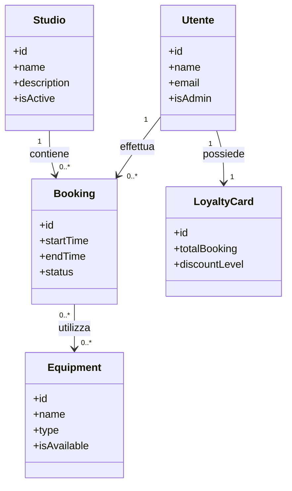
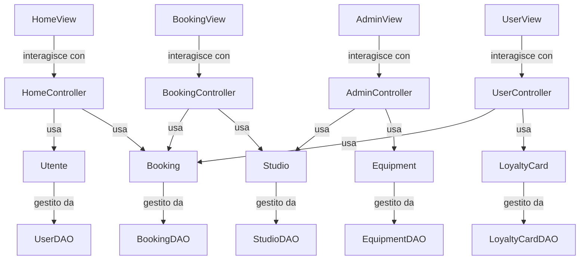
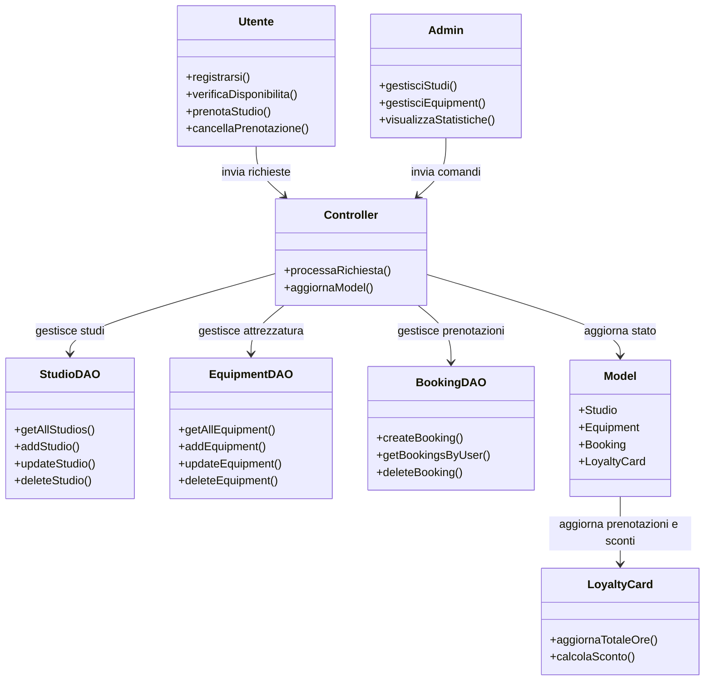
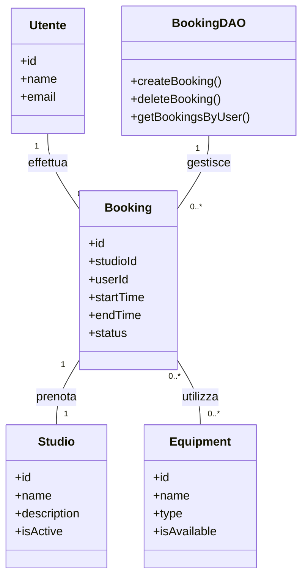
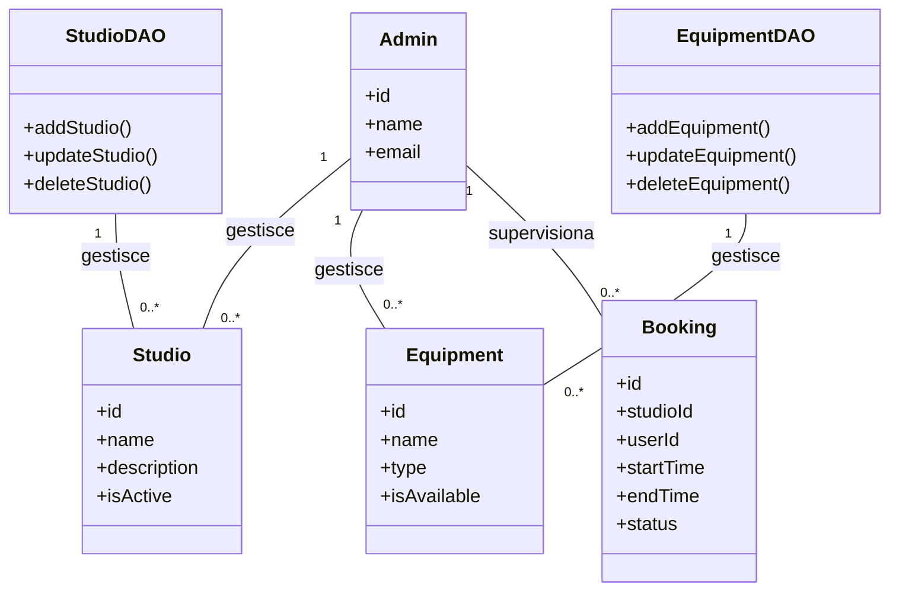
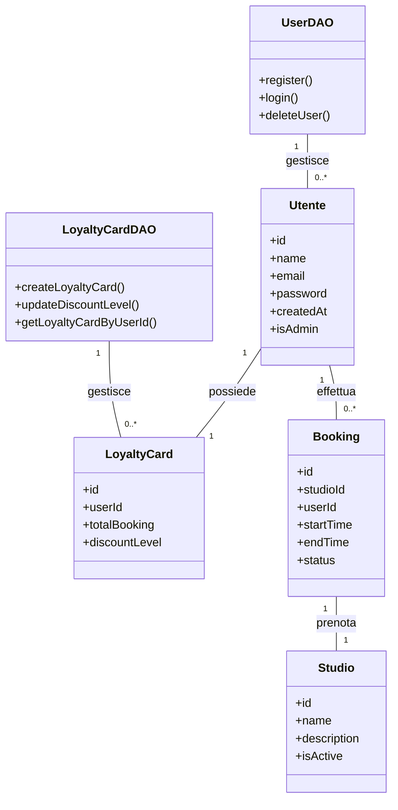
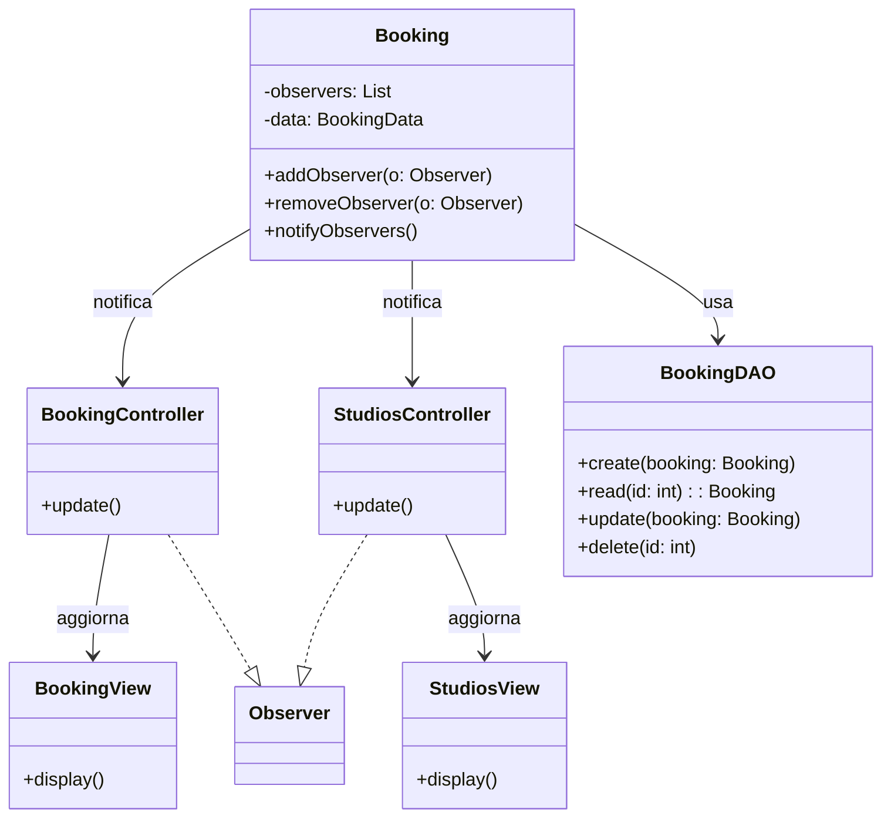
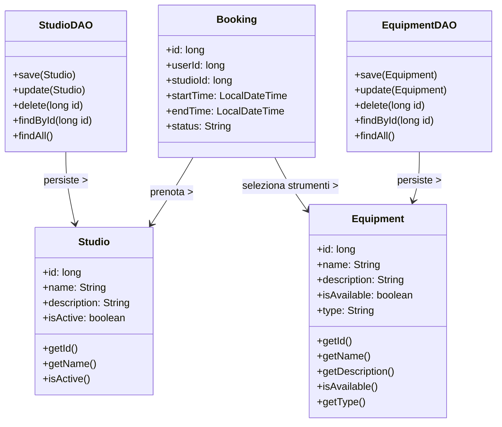
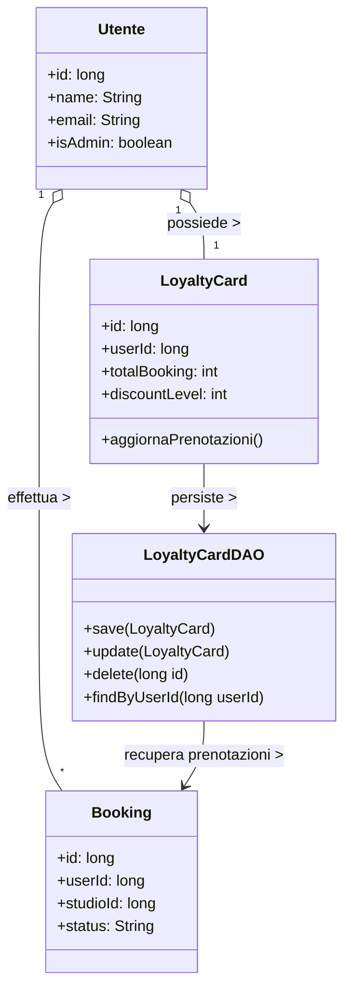

# StudioBooking

Progetto per l’esame di “Progettazione e Sviluppo Software 24-25”  
Autori: Strazzella Elia, Aloè Matteo

---

## Analisi dei Requisiti

L’obiettivo del progetto è la realizzazione e progettazione di un sistema gestionale per la prenotazione di studi 
musicali. 
L’applicazione permette a utenti e amministratori di interagire con una piattaforma che gestisce studi, 
attrezzature e prenotazioni. 

### Requisiti Funzionali

• [RF1] Gestione utenti: registrazione, login e autenticazione con distinzione tra utente
e amministratore. 

• [RF2] Prenotazione di studi con scelta di data, fascia oraria e attrezzature disponibili. 

• [RF3] Visualizzazione e gestione delle prenotazioni da parte degli utenti (storico, 
annullamento). 

• [RF4] Gestione studi e attrezzature da parte dell’amministratore (Operazioni CRUD, 
abilitazione/disabilitazione). 

• [RF5] Sistema di statistiche per gli amministratori (prenotazioni per studio, utilizzo studi, 
prenotazioni attive). 

• [RF6] Sistema di loyalty card per gli utenti (conteggio prenotazioni → sconti). 

### Requisiti Opzionali

• [RO1] Notifiche via email o popup al momento della conferma prenotazione. 

• [RO2] Possibilità di pagamento online integrato. 

• [RO3] Funzionalità di ricerca e filtro avanzato (per data, tipo studio, attrezzatura). 

• [RO4] Interfaccia responsive o porting su applicazione mobile. 



---

## Analisi e modello del dominio 

L’applicazione gestisce prenotazioni di studi, utenti e attrezzature in un contesto asincrono. Il 
dominio è costituito da entità principali come Utente, Studio, Booking, Equipment e LoyaltyCard, 
ciascuna con attributi specifici e relazioni definite. L’accesso ai dati persistenti è centralizzato nei 
DAO, che isolano la logica applicativa dalle operazioni sul database. La struttura consente di rappresentare
chiaramente utenti, studi e prenotazioni, facilitando operazioni come 
creazione, modifica e visualizzazione degli oggetti.

```mermaid
classDiagram
    %% MODEL
    class Utente {
        +long id
        +String name
        +String email
        +String password
        +Timestamp createdAt
        +boolean isAdmin
    }

    class Studio {
        +long id
        +String name
        +String description
        +boolean isActive
    }

    class Booking {
        +long id
        +long userId
        +String userName
        +long studioId
        +LocalDateTime startTime
        +LocalDateTime endTime
        +String status
    }

    class Equipment {
        +long id
        +String name
        +String description
        +boolean isAvailable
        +String type
    }

    class LoyaltyCard {
        +long id
        +long userId
        +int totalBooking
        +int discountLevel
    }

    %% DAO
    class UserDAO {
        +boolean register(Utente)
        +Utente getUserByEmail(String)
        +boolean deleteUser(long)
    }

    class StudioDAO {
        +boolean addStudio(Studio)
        +List~Studio~ getAllStudios()
        +Studio getStudioById(long)
        +boolean updateStudio(Studio)
        +boolean deleteStudio(long)
    }

    class BookingDAO {
        +boolean createBooking(...)
        +List~Booking~ getBookingsByUser(long)
        +boolean deleteBooking(long)
    }

    class EquipmentDAO {
        +List~Equipment~ getAllEquipment()
        +boolean addEquipment(Equipment)
        +boolean updateEquipment(Equipment)
        +boolean deleteEquipment(long)
    }

    class LoyaltyCardDAO {
        +boolean createLoyaltyCard(long userId)
        +LoyaltyCard getLoyaltyCardByUserId(long)
        +boolean updateDiscountLevel(long userId, int totalBooking)
    }

    %% CONTROLLER
    class HomeController
    class AdminController
    class BookingController
    class UserController

    %% VIEW
    class HomeView
    class AdminView
    class BookingView
    class UserView

    %% RELAZIONI
    HomeController --> HomeView
    AdminController --> AdminView
    BookingController --> BookingView
    UserController --> UserView

    HomeController --> UserDAO
    HomeController --> StudioDAO
    AdminController --> UserDAO
    AdminController --> StudioDAO
    AdminController --> EquipmentDAO
    AdminController --> BookingDAO
    BookingController --> BookingDAO
    BookingController --> EquipmentDAO
    BookingController --> StudioDAO
    UserController --> BookingDAO
    UserController --> StudioDAO
    UserController --> LoyaltyCardDAO

    %% MODEL ↔ DAO
    UserDAO --> Utente
    StudioDAO --> Studio
    BookingDAO --> Booking
    EquipmentDAO --> Equipment
    LoyaltyCardDAO --> LoyaltyCard
```


---

## Design 

Il progetto adotta un’architettura MVC (Model - View - Controller), dove i Controller mediano tra Model e View, scambiando 
informazioni tramite DTO per trasferire solo i dati necessari. I DAO gestiscono la persistenza, 
garantendo modularità e testabilità. Le View aggiornano le informazioni in modo asincrono, 
indipendente dal Model grazie al pattern Observer. L’approccio 
modulare consente di estendere facilmente funzionalità e di mantenere una separazione chiara tra 
logica di business e interfaccia utente. 


---

## Architettura del sistema 

L’architettura di StudioBooking si basa sul pattern MVC (Model-View-Controller), che permette 
di separare chiaramente la logica applicativa dall’interfaccia utente e dalla gestione dei dati. Il 
Controller funge da tramite principale: riceve gli input dall’utente tramite la View e invoca i 
metodi appropriati sui DAO o direttamente sul Model per aggiornare lo stato del sistema. Il Model 
rappresenta le entità principali (Utente, Studio, Booking, Equipment e LoyaltyCard) e 
contiene le regole di dominio necessarie per il corretto funzionamento dell’applicazione. I DAO (Data Access Object) 
gestiscono la persistenza dei dati, consentendo di leggere e scrivere sul database (MySql) senza che le altre 
componenti debbano conoscere i dettagli di accesso. Infine, la View si occupa di presentare 
all’utente le informazioni provenienti dal Model e di notificare al Controller le azioni eseguite. 



---

## Design Dettagliato 

In questa sezione vengono approfonditi alcuni elementi del design del sistema di gestione delle 
prenotazioni, mostrando le scelte architetturali principali, le motivazioni e l’uso di eventuali pattern 
di progettazione. 

### 1. Aloè Matteo – Prenotazione e Cancellazione / Gestione Amministratore / Register & Login 

#### Prenotazione e Cancellazione 

Durante lo sviluppo della funzionalità di prenotazione e cancellazione, ho voluto garantire che 
l’utente potesse interagire facilmente con gli studi disponibili e gestire le proprie prenotazioni in 
modo intuitivo. Ho implementato un sistema in cui il calendario tiene traccia delle fasce orarie mostrando un pallino rosso sulle date
occupate. Cosi facendo evitiamo conflitti, e le modifiche vengono immediatamente riflesse nella view. La logica 
di creazione e cancellazione è stata centralizzata nel BookingDAO, separando così l’interfaccia 
grafica dalla gestione del database e rendendo il sistema più testabile e robusto. 




#### Gestione Amministratore 

La gestione dell’amministratore è stata progettata per permettere il controllo completo dell'applicazione.
Ho creato interfacce che consentono l’aggiunta, la rimozione o la sospensione di 
attrezzature, studi e prenotazioni. Tutte queste operazioni passano attraverso i DAO corrispondenti (StudioDAO e 
EquipmentDAO), garantendo che la logica di business e le modifiche al database siano centralizzate 
e consistenti, mentre la view rimane semplice e chiara per l’uso dell’amministratore. 
Vi è anche la possibilità di visualizzare tutte le prenotazioni effettuate dall utente e le prenotazioni attive per i determinati studi, cosi da avere un idea della tendenza.



#### Register & Login 

Per la registrazione e il login, ho centralizzato la logica di creazione e autenticazione degli utenti nel 
UserDAO. Questo ha permesso di separare chiaramente la gestione dei dati dal rendering grafico. 
La view mostra a sua volta anche le ultime sessioni prenotate dall’utente, integrando la carta fedeltà e fornendo 
informazioni aggiornate sulle attività precedenti.

---

### 2. Strazzella Elia – Verifica Disponibilità / Gestione Studi e Attrezzature / Carta Fedeltà 

Il mio contributo ha riguardato la progettazione del modulo che gestisce la disponibilità degli studi, le 
attrezzature e la carta fedeltà degli utenti. 

#### Verifica Disponibilità

Per la verifica disponibilità, la classe Booking funge da soggetto osservato: ogni volta che una prenotazione viene creata, modificata o cancellata, i controller associati (BookingController e StudiosController) aggiornano automaticamente le view (BookingView.fxml e StudiosView.fxml), implementando il pattern Observer. Il tutto funziona grazie alle 2 funzioni create HasConflict() e IsAvaible(), che prima di confermare qualsiasi prenotazione effettuano un check per verificare che non vi siano altre prenotazioni nella stessa data e fascia oraria.
Il collegamento con il BookingDAO permette di isolare l’accesso al database: tutte le operazioni di lettura e scrittura delle prenotazioni passano attraverso il DAO, garantendo separazione tra logica di business e logica di persistenza.



#### Gestione Studi e Attrezzature

La gestione degli studi di registrazione e delle attrezzature è stata modellata attraverso le classi Studio ed Equipment. Gli utenti possono selezionare gli strumenti con cui lavorare durante le ore prenotate, mentre gli attributi di Equipment (name, description, isAvailable, type) permettono di monitorarne disponibilità e tipologia. Le attrezzature e gli studi sono gestiti in moduli separati, garantendo modularità ed estendibilità: è possibile aggiungere nuovi strumenti o nuovi studi senza modificare la logica esistente. Il collegamento con EquipmentDAO e StudioDAO permette di leggere, aggiornare o aggiungere elementi nel database senza intaccare la logica dell’applicazione. 


#### Carta Fedeltà 

Per la carta fedeltà ho utilizzato la classe LoyaltyCard, collegata all’utente tramite la classe Utente. Ogni volta che una prenotazione viene completata, il metodo updateBooking() aggiorna automaticamente il numero totale di prenotazioni registrate dalla carta. Anche qui, il LoyaltyCardDAO gestisce l’accesso alla persistenza, isolando il modello dai dettagli di database. Questa scelta semplifica la gestione, rendendola trasparente per l’utente e facilmente estendibile per future funzionalità come sconti personalizzati.



---

## Testing automatizzato 

Durante lo sviluppo di StudioBooking, abbiamo scelto di concentrare i test 
automatizzati solo a partire da una fase del progetto in cui la struttura del codice fosse ormai 
consolidata. Questo approccio ci ha permesso di sviluppare prima le funzionalità principali in modo 
modulare, senza dover riscrivere continuamente test a causa di modifiche strutturali. Una volta 
raggiunta una base stabile, abbiamo implementato una suite di test per verificare il corretto 
funzionamento dei modelli, dei DAO e dei flussi principali del sistema. 

Esempio di test su BookingDAO:
```java
@Test 
void testCreateAndRetrieveBooking() { 
    BookingDAO bookingDAO = new BookingDAO(); 
    Booking booking = new Booking(0, 34, "Matteo", 1, 
            LocalDateTime.of(2026, 10, 22, 10, 0), 
            LocalDateTime.of(2026, 10, 22, 12, 0), 
            "CONFIRMED"); 
    boolean created = bookingDAO.createBooking( 
            booking.getUserId(), 
            booking.getStudioId(), 
            booking.getStartTime(), 
            booking.getEndTime(), 
            new ArrayList<>() 
    ); 
    assertTrue(created, "La prenotazione dovrebbe essere creata con successo"); 
    Booking retrieved = bookingDAO.getBookingsByUser(booking.getUserId()) 
            .stream() 
            .filter(b -> b.getStudioId() == booking.getStudioId()) 
            .findFirst().orElse(null); 
    assertNotNull(retrieved, "La prenotazione non dovrebbe essere null"); 
    assertEquals(booking.getUserName(), retrieved.getUserName(), "Il nome utente dovrebbe corrispondere"); 
} 
```

Esempio di test su LoyaltyCardDAO:
```java
@Test 
void testUserRegistrationAndLoyaltyCard() { 
    UserDAO userDAO = new UserDAO(); 
    LoyaltyCardDAO cardDAO = new LoyaltyCardDAO(); 
    Utente user = new Utente(0, "Test User", "testuser@example.com", 
                             "password", new Timestamp(System.currentTimeMillis()), false); 
    assertTrue(userDAO.register(user)); 
    assertTrue(cardDAO.createLoyaltyCard(user.getId())); 
    LoyaltyCard retrieved = cardDAO.getLoyaltyCardByUserId(user.getId()); 
    assertNotNull(retrieved); 
    assertEquals(0, retrieved.getTotalBooking()); 
    assertEquals(0, retrieved.getDiscountLevel()); 
} 
```
Esempio di Test su UserDAO
```java
 @Test
    void testRegisterAndRetrieveUser() {
        Utente user = new Utente(0, "Test User", "testuser@example.com", "password123", new Timestamp(System.currentTimeMillis()), false);

        // Registrazione
        boolean created = userDAO.register(user);
        System.out.println("Utente registrato? " + created);
        assertTrue(created);

        // Recupero
        Utente retrieved = userDAO.getUserByEmail("testuser@example.com");
        System.out.println("Utente recuperato: " + retrieved);
        assertNotNull(retrieved);
        assertEquals("Test User", retrieved.getName());

        // --- Cleanup: elimina l'utente appena creato ---
        if (retrieved != null) {
            boolean deleted = userDAO.deleteUser(retrieved.getId());
            System.out.println("Utente eliminato: " + deleted);
        }
    }
```

Esempio di Test su BookingTest

```java
@Test
    void testBookingToString() {
        System.out.println("=== Inizio testBookingToString ===");
        LocalDateTime start = LocalDateTime.of(2025, 9, 22, 10, 0);
        LocalDateTime end = LocalDateTime.of(2025, 9, 22, 12, 0);
        Booking booking = new Booking(1, 34, "Matteo", 2, start, end, "CONFIRMED");

        System.out.println("Booking creato: " + booking);

        String expected = "Prenotazione #1 | Utente: Matteo | Studio: 2 | 22/09/2025 10:00 → 22/09/2025 12:00 | Stato: CONFIRMED";
        assertEquals(expected, booking.toString());

        System.out.println("TestBookingToString completato con successo");
    }
```
Esempio di Test su UserTest
```java
@Test
    void testGettersAndSetters() {
        System.out.println("=== Inizio test Utente ===");

        Timestamp now = new Timestamp(System.currentTimeMillis());
        Utente u = new Utente(1, "Mario Rossi", "mario@example.com", "password", now, false);

        System.out.println("Utente creato: id=" + u.getId() + ", name=" + u.getName() +
                           ", email=" + u.getEmail() + ", admin=" + u.isAdmin());

        assertEquals(1, u.getId());
        assertEquals("Mario Rossi", u.getName());
        assertEquals("mario@example.com", u.getEmail());
        assertEquals("password", u.getPassword());
        assertEquals(now, u.getCreatedAt());
        assertFalse(u.isAdmin());

        System.out.println("Aggiornamento valori name, email, password e admin");
        u.setName("Luigi Bianchi");
        u.setEmail("luigi@example.com");
        u.setPassword("1234");
        u.setAdmin(true);

        System.out.println("Valori aggiornati: name=" + u.getName() + ", email=" + u.getEmail() +
                           ", password=" + u.getPassword() + ", admin=" + u.isAdmin());

        assertEquals("Luigi Bianchi", u.getName());
        assertEquals("luigi@example.com", u.getEmail());
        assertEquals("1234", u.getPassword());
        assertTrue(u.isAdmin());

        System.out.println("Test Utente completato con successo");
    }
```

---

## Note di Sviluppo 

Durante lo sviluppo del progetto, abbiamo voluto centralizzare tutta la logica di gestione delle 
prenotazioni, utenti e attrezzature all’interno dei DAO, in modo da separare il front-end dalla logica 
di business. Alcuni esempi chiave includono: 

### 1. Creazione di una prenotazione (BookingDAO.createBooking)
```java
public boolean createBooking(long userId, long studioId, LocalDateTime startTime, 
LocalDateTime endTime, List<Equipment> equipmentList) { 
    if (!isTimeSlotAvailable(studioId, startTime, endTime)) return false; 

    try (Connection conn = Database.getConnection()) { 
        String sql = "INSERT INTO bookings (user_id, studio_id, start_time, end_time, status) VALUES (?, ?, ?, ?, ?)"; 
        PreparedStatement ps = conn.prepareStatement(sql); 
        ps.setLong(1, userId); 
        ps.setLong(2, studioId); 
        ps.setTimestamp(3, Timestamp.valueOf(startTime)); 
        ps.setTimestamp(4, Timestamp.valueOf(endTime)); 
        ps.setString(5, "CONFIRMED"); 

        ps.executeUpdate(); 

        // aggiungi attrezzature prenotate 
        for (Equipment eq : equipmentList) { 
            assignEquipmentToBooking(eq.getId(), userId, startTime, endTime); 
        } 

        return true; 
    } catch (SQLException e) { 
        e.printStackTrace(); 
        return false; 
    } 
} 
```

### 2. Registrazione utente (UserDAO.register)
```java
public boolean register(Utente user) { 
    try (Connection conn = Database.getConnection()) { 
        String sql = "INSERT INTO users (name, email, password, created_at, is_admin) VALUES (?, ?, ?, ?, ?)"; 
        PreparedStatement ps = conn.prepareStatement(sql); 
        ps.setString(1, user.getName()); 
        ps.setString(2, user.getEmail()); 
        ps.setString(3, user.getPassword()); 
        ps.setTimestamp(4, user.getCreatedAt()); 
        ps.setBoolean(5, user.isAdmin()); 
        ps.executeUpdate(); 
        return true; 
    } catch (SQLException e) { 
        e.printStackTrace(); 
        return false; 
    } 
} 
```

### 3. Aggiornamento della carta fedeltà in real-time (LoyaltyCardDAO.refreshLoyaltyCard)
```java
public boolean refreshLoyaltyCard(long userId) { 
    LoyaltyCard card = getLoyaltyCardByUserId(userId); 
    if (card == null) return false; 

    int totalBooking = card.getTotalBooking() + 1; 
    int discountLevel = (totalBooking / 3) * 5; // esempio di calcolo sconto 
    card.setTotalBooking(totalBooking); 
    card.setDiscountLevel(discountLevel); 

    return updateCardInDB(card); 
} 
```

### 4. Verifica disponibilità fascia oraria (BookingDAO.isTimeSlotAvailable)
```java
public boolean isTimeSlotAvailable(long studioId, LocalDateTime startTime, LocalDateTime endTime) { 
    List<Booking> bookings = getBookingsByStudio(studioId); 
    for (Booking b : bookings) { 
        if (startTime.isBefore(b.getEndTime()) && endTime.isAfter(b.getStartTime())) { 
            return false; // conflitto trovato 
        } 
    } 
    return true; 
} 
```

### 5. Attivazione/disattivazione attrezzatura (EquipmentDAO.toggleEquipmentAvailability)
```java
public boolean toggleEquipmentAvailability(long equipmentId) { 
    Equipment equipment = getEquipmentById(equipmentId); 
    if (equipment == null) return false; 

    equipment.setAvailable(!equipment.isAvailable()); 
    return updateEquipmentInDB(equipment); 
} 
```

Questi cinque punti mostrano chiaramente come l’architettura DAO consenta di gestire 
centralmente la logica di business, separandola dalla view e facilitando test e manutenzione. 

---

## Commenti Finali

### Aloè
Il progetto si è rivelato un'esperienza stimolante e impegnativa, che abbiamo affrontato passo dopo passo fino al raggiungimento di un risultato soddisfacente. Abbiamo deciso di completarlo come progetto finale del secondo anno, poiché ritenevamo che valesse la pena dedicargli più tempo e attenzione senza compromettere la nostra preparazione per gli esami rimanenti.
All'inizio non è stato facile, soprattutto perché era la mia prima volta che programmavo in Java e l'utilizzo di JavaFX non era particolarmente intuitivo. In alcuni casi, l'IDE segnalava le implementazioni corrette come errori, il che creava ulteriori difficoltà. Tuttavia, grazie a diversi tentativi e a una costante voglia di migliorare, siamo riusciti a dare vita al nostro progetto.
L'elemento più impegnativo è stato senza dubbio lo sviluppo della funzione di prenotazione, il vero cuore dell'applicazione. In particolare, la gestione della disponibilità delle apparecchiature in base al giorno e all'ora richiesti, nonstante ciò dopo vari tentativi siamo riusciti a finire anche quella implementazione.

### Strazzella

---

## 📖 Guida Utente

### Registrazione e Login
1. Avvia l’applicazione StudioBooking.
2. Se sei un nuovo utente, vai su **Registrati** e compila i campi richiesti (nome, email, password).
3. Se hai già un account, accedi con **Login**.

### Prenotazione di uno Studio
1. Accedi alla sezione **Prenotazioni**.
2. Seleziona lo **studio musicale** che desideri prenotare.
3. Scegli **data e fascia oraria** disponibili.
4. Scegli le attrezzature disponibili (es. microfoni, monitor, scheda audio).
5. Conferma la prenotazione.

### Gestione Prenotazioni
- Possibilità di annullare una prenotazione entro le 24h.
- Puoi visualizzare lo storico e la propria carta Fedeltà.
  
### Funzioni Amministratore
- Creare, modificare o disabilitare studi e attrezzature.
- Consultare statistiche di utilizzo (prenotazioni attive, studio piu utilizzato, ecc.).

### Carta Fedeltà
- Ogni prenotazione completata incrementa il contatore della tua carta fedeltà.
- Al raggiungimento di determinate soglie (ogni 3 prenotazioni) ottieni **sconti**.

